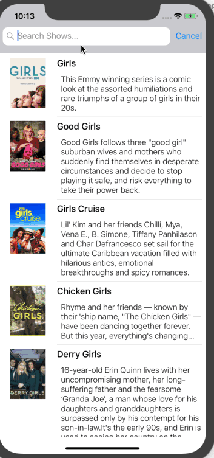

<H1>TV SHOWS</H1>
User can see tv shows and search data from listing data.</b>
<H2>External Libraries</H2>
<a href = "https://github.com/Alamofire/Alamofire"> Alamofire</a> allows us to get data from server.</b>
<H2>Screen Gif</H2>

